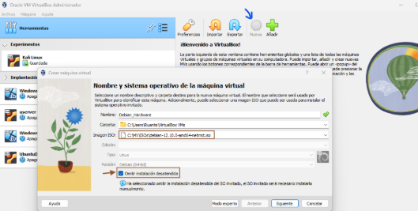

# **Tarea 2.3: Montado de un sistema de ficheros con chroot**

## **Descripción de la tarea** 

En esta práctica se va a hacer uso de una máquina base, la cual va a contar con un usuario y contraseña. La idea es hacer uso de la imagen .iso de otra distribución para poder recuperar el usuario y contraseña en cuestión. En esta tarea se propone como máquina base una distribución debian y la .iso empleada como máquina live será una Kali Linux. 

## **Pasos de la tarea** 

**1\. Realiza una instalación desde cero de una máquina virtual con sistema operativo Debian y en ella tiene que existir un usuario cuyo nombre sea tu nombre personal.**

Para comenzar le daremos a nueva en virtualbox, añadiremos la iso descargada de web de debian, un nombre a la máquina y le daremos a **'Omitir instalación desatendida’** . Luego ya es añadir la ram y espacio que queramos y finalizamos. 

Una vez iniciada la máquina le damos a instalación gráfica, elegimos un idioma, nuestra ubicación, el teclado y dejamos que se instalen algunos paquetes.

Ahora configuramos la red, introducimos el nombre de la máquina, el dominio lo dejamos en blanco, configuramos las contraseñas del superusuario, configuramos el nombre del nuevo usuario, su contraseña, configuramos el reloj, dejamos que el particionado de discos sea guiado y dejamos instalar el sistema base.

En la configuración del gestor de paquetes le damos a todo para adelante y dejamos esta selección de programas:

Por último instalamos el grub y se terminara la instalación. Reiniciamos el debian y estará instalado gráficamente:

**2\. En ajustes de VirtualBox, en la parte de almacenamiento se tendrá que añadir la imagen de otro sistema operativo, en esta práctica se hará uso de una imagen de Kali Linux. Además, hay que tener en cuenta que en el orden de arranque tiene que figurar previamente la opción óptica sobre disco duro.**

Para hacer este paso primero vamos a la configuración de la mv y vamos a su configuración y almacenamiento. Una vez dentro en Controlador: IDE le daremos a añadir unidad optica:

Buscamos la iso de la kali y la insertamos y aplicamos:

Luego iremos a **Sistema -> Placa base** . Ahí nos fijamos que Óptica esté por encima de Disco Duro tal que así:

**3\. Arrancamos la máquina virtual y debería cargarse como sistema operativo el propio de Kali Linux.**

`	`Ahora al iniciar la máquina nos inicia con la instalación de la kali Linux:

`	`

La instalación de la kali será prácticamente como la instalación de la debian, a continuación algunas capturas de lo más importante:

**4\. En terminal se realizarán los siguientes pasos:**

* **1\. Cambiar a castellano el teclado.**

    Por si no lo instalamos en español el teclado y tenemos necesidad podríamos hacer el comando ‘**setxkbmap es**’:

     

* **2\. Acceder a la consola de root como administrador a través de los permisos configurados con el comando sudo (/etc/sudoers, visudo).**

    

* **3\. Mostrar el sistema de ficheros montado, es decir, los que está a usar y podemos utilizar en este sistema operativo live debian.**

    Con el comando ‘**df -h**’ podemos ver la información del sistema de ficheros montado.

    

**4\. Lista la tabla de particiones del disco /dev/sda.**

**5\. Crea el directorio /mnt/recuperar.** 

**6\. Monta la partición 1 del disco duro /dev/sda en el directorio del sistema operativo creado en el paso anterior /mnt/recuperar en la máquina live.**  

Con la opción -t auto solicitamos al comando mount la autodetección del sistema de ficheros montado. Podemos ver este sistema de ficheros con el comando lsblk -f.

**7\. Monta el directorio /dev dentro de la ruta /dev/recuperar/dev para poder tener acceso a todos los dispositivos reconocidos por la distribución live.**

**¿Para que sirve el --bind?**

    Es como un punto de enlace entre el contenido de una carpeta ya existente con la nueva carpeta en donde se va a ver como en tiempo real la misma información.

**8\. Monta el directorio /proc dentro de /mnt/recuperar/proc para poder tener acceso a los procesos del sistema y kernel de kali linux gracias a la distribución live.** 

**9\. Monta el directorio /sys dentro de /mnt/recuperar/sys para poder tener acceso al hardware y kernel de kali linux gracias a la distribución live.** 

**10\. Creamos una jaula mediante el comando chroot.**

Con este comando creamos una jaula, es decir, un entorno cerrado para la distribución Linux que vamos a recuperar, de tal modo que, una vez dentro de la jaula, sólo existe ésta. Por este motivo, al modificar el directirio **/**  a **/mnt/recuperar**  sólo existe la distribución Linux instalada en el disco duro **/dev/sda**  que queremos recuperar, ya no estamos trabajando en la Live sino en el propio sistema Debian. 

**11\. Desmonta los directorios anteriormente montados para la recuperación del sistema, es decir, /mnt/recuperar/dev, /mnt/recuperar/proc, /mnt/recuperar/sys y /mnt/recuperar.**

Primero debemos salir del chroot, para ello hacemos un exit y procedemos con la desinstalación de los directorios:

Si al intentar desmontar **/mnt/recuperar**  le añadimos **-l** para que sea un eliminado forzoso.

**12\. Apaga la máquina, en configuración elimina la .iso de la live y accede al sistema nuevamente.**

Para este último paso hacemos un poweroff en la terminal para apagar la kali. Luego iremos a la configuración de la máquina, almacenamiento y quitamos la imagen iso como en la imagen: 

Ahora sí por último iniciamos la máquina y accedera al sistema de nuevo.
